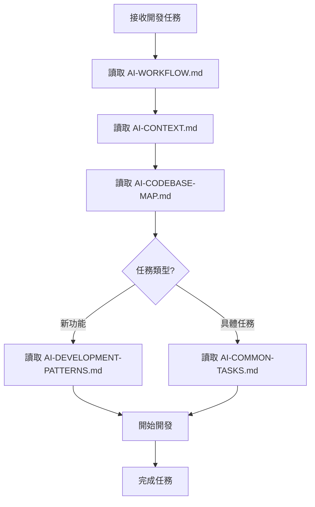

# 🤖 AI 開發工作區

**專為 AI 開發者設計的快速啟動文檔庫**

## ⚡ 快速啟動（AI 必讀）

### 🎯 立即行動清單
```
1. 讀取 AI-WORKFLOW.md     → 了解 AI 工作流程
2. 讀取 AI-CONTEXT.md      → 掌握專案核心上下文  
3. 讀取 AI-CODEBASE-MAP.md → 理解檔案結構映射
4. 根據開發任務類型選擇：
   - 功能開發 → AI-DEVELOPMENT-PATTERNS.md
   - 具體任務 → AI-COMMON-TASKS.md
```

### 🚀 AI 工作原則
- **無需重新掃描**：所有必要資訊都在這個目錄
- **上下文優先**：先理解再開發
- **模式導向**：遵循既定的開發模式
- **範例驅動**：參考實際任務範例

## � 檔案功能索引

| 檔案 | 用途 | 讀取時機 |
|------|------|----------|
| `AI-WORKFLOW.md` | AI 工作流程指引 | 每次開始前必讀 |
| `AI-CONTEXT.md` | 專案核心上下文 | 第一次開發必讀 |
| `AI-CODEBASE-MAP.md` | 完整檔案映射 | 需要定位檔案時 |
| `AI-DEVELOPMENT-PATTERNS.md` | 開發模式與規範 | 編寫新程式碼時 |
| `AI-COMMON-TASKS.md` | 常見任務範例 | 處理具體功能時 |
| `AI-QUICK-REFERENCE.md` | 快速命令參考 | 需要快速查詢時 |

## 🎪 專案基本資訊

- **專案類型**：WordPress 付款閘道外掛
- **主要功能**：藍新金流支付整合
- **技術架構**：PHP + WooCommerce + WordPress
- **開發模式**：面向 AI 的快速開發

## 🔄 AI 開發流程



## 🌐 本地化支援

### 語言支援
- **預設語言**: 繁體中文 (Taiwan)
- **Text Domain**: `newebpay-payment`
- **翻譯範圍**: 完整的前台和後台介面
- **特色**: 插件預設即為繁體中文介面，無論在任何語言環境下都會顯示繁體中文

### 翻譯檔案結構
```
languages/
├── newebpay-payment.pot          # 翻譯模板
├── newebpay-payment-zh_TW.po     # 繁體中文源文件
├── newebpay-payment-zh_TW.mo     # 繁體中文編譯文件
└── README.md                     # 本地化說明
```

## 📋 開發任務分類

### � 基礎功能
- 新增付款方式
- 修改付款流程  
- 更新 API 介面
- 調整安全設定

### 🎨 前端開發
- 客製化付款表單
- 調整結帳流程
- 修改樣式設計

### ⚙️ 後台管理
- 新增設定選項
- 建立報表功能
- 管理交易記錄

### � 問題修復
- 修復支付錯誤
- 解決回調問題
- 優化效能問題

## 💡 AI 使用提示

1. **優先讀取核心文件**：確保理解專案本質
2. **使用檔案映射**：快速定位目標檔案
3. **遵循開發模式**：保持程式碼一致性
4. **參考任務範例**：加速開發進度
5. **無需額外掃描**：所有資訊已經整理完成

---

> 這個文檔庫的設計目標：讓任何 AI 在 5 分鐘內進入開發狀態，無需重新學習整個程式庫。

## 📜 版本歷史資訊

### 最新狀態
- **版本**: v1.0.10
- **狀態**: ✅ 生產環境就緒 - WooCommerce Blocks 完全整合 + 購物車清空機制修復
- **最後更新**: 2025-09-20
- **最新修復**: 購物車清空機制完全修復 - 支援登入/訪客用戶、本機開發環境、WooCommerce Blocks

### 重要技術資訊
- **智慧ATM2.0 格式**: VACC + SourceType (不是 SMARTPAY)
- **參數名稱**: SourceBankId (注意最後是小寫 d)
- **失敗處理**: 任何非 SUCCESS 狀態自動觸發重試付款
- **Blocks 整合**: 完全支援 WooCommerce Blocks 結帳
- **本地化支援**: 完整繁體中文本地化，預設即為繁體中文介面
- **購物車清空**: 多層保護機制確保付款完成後購物車正確清空

## 📚 關鍵文檔

### 開發流程
1. **規劃** → 檢閱 `.ai-dev-docs/` 目錄文檔
2. **實作** → 參考 `AI-DEVELOPMENT-PATTERNS.md`
3. **測試** → 使用 `AI-COMMON-TASKS.md` 範例
4. **問題排除** → 查閱 `reports/` 目錄
5. **版本記錄** → 查閱 `reports/` 目錄

## 📞 技術支援

- 藍新金流客服: cs@newebpay.com
- API 文檔: https://www.newebpay.com/website/Page/content/download_api#2

---

> 💡 **提示**: 建議按照 AI 開發文檔的順序閱讀，先從 `AI-WORKFLOW.md` 開始。

## 最新修復技術要點

### WooCommerce Blocks 資料流
1. 前端用戶選擇支付方式
2. JavaScript 處理 `onPaymentSetup` 事件
3. 透過 `paymentMethodData` 傳遞到後端
4. `process_payment_with_blocks_context` 處理資料
5. 設定 `$_POST` 變數給傳統流程使用
6. `validate_fields` 驗證並轉換支付方式
7. `get_newebpay_args` 生成最終 API 參數

### 智慧ATM2.0 特殊處理
- **不是** 使用 `SMARTPAY = 1`
- **正確格式**: `VACC = 1` + `SourceType = 4`
- 需要額外的 `SourceBankId` 和 `SourceAccountNo` 參數（注意 SourceBankId 最後是小寫 d）

### 支付方式對應
```php
$payment_config_map = array(
    'credit' => 'Credit',
    'vacc' => 'Vacc', 
    'smartpay' => 'SmartPay',  // 注意駝峰式
    'linepay' => 'LINEPAY',
    'applepay' => 'APPLEPAY',
    // ...
);
```

## 快速驗證測試

```bash
# 檢查 REST API 狀態
curl -sS "http://your-site.local/wp-json/newebpay/v1/status" | jq .

# 檢查付款方式
curl -sS "http://your-site.local/wp-json/newebpay/v1/payment-methods" | jq .
```

將 `your-site.local` 替換為您的開發環境主機名稱。

---

**版本**: v1.0.10  
**狀態**: ✅ 生產環境就緒 - 完整繁體中文本地化支援  
**最後驗證**: 2025-09-03
